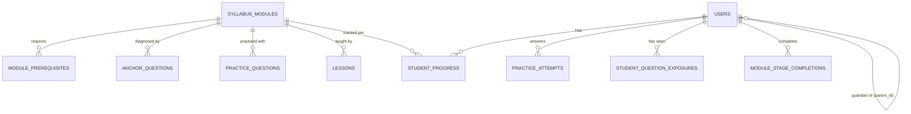

# Data Model

The SEA curriculum is modelled as data; the engine operates over it. This page is the conceptual model
— the generated [table reference](../reference/schema.md) lists every column.

## The curriculum as data

| Entity | Rows (prod) | Notes |
|---|---|---|
| `syllabus_modules` | 90 | The SEA framework as teachable modules (Math 1–51, ELA/Writing 52–90). Stable `code` (MATH-001…). |
| `module_prerequisites` | 150 | Directed acyclic "B requires A" edges. Dense graph, conservative inference. |
| `anchor_questions` | 120 | Diagnostic MC items (Math 65 / ELA 43 / Writing 12), linked many-to-many to modules. |
| `practice_questions` | ~6,175 | Practice bank, ~2,000 per difficulty rung (D1/D3/D5). |
| `lessons` | 90 | One interactive lesson per module (version-controlled JSON in `database/data/lessons/`). |
| `reading_passages` / `vocabulary_words` | 151 / 452 | Daily reading pool (≥30 per level) + per-passage vocab. |
| `writing_prompts` | 37 | One shared prompt per study week. |

## Learner state (the progress tables)

| Table | What it holds | Danger |
|---|---|---|
| `student_progress` | Per (student, module) status + rung + streak | `FK module_id → syllabus_modules ON DELETE CASCADE` |
| `module_stage_completions` | Which stages a student finished | same cascade |
| `practice_attempts` | Every answered practice question | — |
| `student_question_exposures` | No-repeat ledger (by content hash + context) | — |

!!! danger "The cascade that bit us three times"
    `student_progress` and `module_stage_completions` cascade-delete when a `syllabus_modules` row is
    removed. A seeder that `truncate()`d modules therefore wiped **all** learner progress on every
    deploy that ran it. Seeders are now idempotent (`updateOrCreate`) and `db:seed` is **never** run on
    production. Full story in [Runbooks](../operations/runbooks.md).

## Isolation: synthetic accounts

`users.is_test` flags QA/agent accounts so they are excluded from real analytics (`User::real()` scope)
and cleanly removable. See [QA agent surface](../operations/qa-agent.md).

## Source of truth

- Schema: migrations in `database/migrations/` (generated reference: [schema](../reference/schema.md)).
- Content: `database/data/` (YAML/JSON) seeded idempotently by `database/seeders/`.
- Conceptual spec: `formynieces-spec/02_OBJECT_MODEL.md`.
