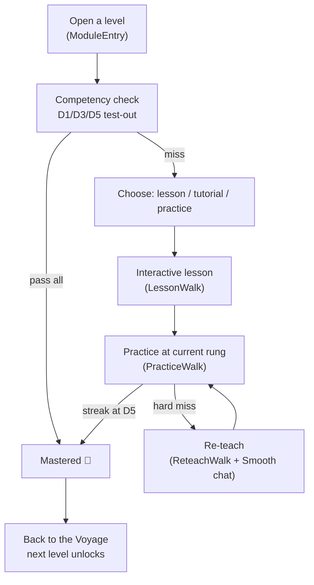

# The Learning Loop

The learning loop is the core teaching engine. Everything else (the Voyage map, pacing, motivation,
the guardian dashboard) orbits it. It is deterministic PHP — the same inputs always produce the same
mastery decision — with AI used only to *coach*, never to *grade the path*.

## The loop, end to end

## Rungs and mastery

- Practice is served at the student's **current rung** — difficulty **D1 → D3 → D5**.
- Mastery is earned by a **first-try streak at D5**; the engine advances the rung as she succeeds and
  routes her to a re-teach on a hard miss.
- A **content-hash no-repeat** rule (LL-18) guarantees a question is never served twice. This is why
  the content pools must be deep (see [Runbooks → reading pool](../operations/runbooks.md)).
- Exposure is recorded **on answer, not on serve** — viewing/refreshing never burns a question.

!!! warning "No-repeat is context-scoped"
    The tutorial draws worked examples from the **same** D1 practice bank. Practice/check no-repeat
    therefore excludes `context = 'tutorial'` exposures (`QuestionExposure::pickUnseen(..., excludeContexts: ['tutorial'])`),
    so teaching views can't drain the practice pool. Removing that scoping dead-ends practice on
    "more practice coming soon".

## The re-teach

When practice pulls her back, she re-walks *this lesson*. Each interactive block carries its own
`rule` + ≥4 same-rule `practiceItems`, so the chat remediates the **failed block's** rule specifically.
Reasoning blocks additionally carry `principle`, `canonical_solution`, `rubric`, `misconceptions`, and
`sample_answers` — the exemplars the LLM judge grades thinking against (and the fallback when the LLM
is unavailable).

## AI at the edges

AI never decides mastery. It is used for: **essay scoring**, **re-teach / clarify chat**,
**worked-example generation**, and **school-journal OCR**. Every call is metered by
[`LlmBudget`](https://github.com/ipmarecheau/formynieces/blob/main/app/Services/LlmBudget.php):

- **Discretionary** (chat, re-teach, worked examples) stops at a soft monthly cap.
- **Essential** (essay grading, guardian summaries) runs to a hard monthly cap.
- Caps are **per student per month**; the provider is OpenRouter (`services.llm.*`). Tests stub/fallback
  so the suite never needs a live key.

## Related specs

- Gherkin: `formynieces-spec/features/learning_loop.feature`, `lesson.feature`, `diagnostic.feature`
- Authoring: `formynieces-spec/lesson_development_guide.md`, the `lesson-authoring` skill
