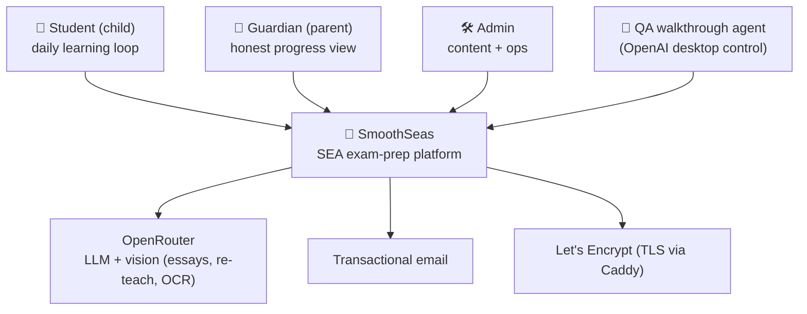
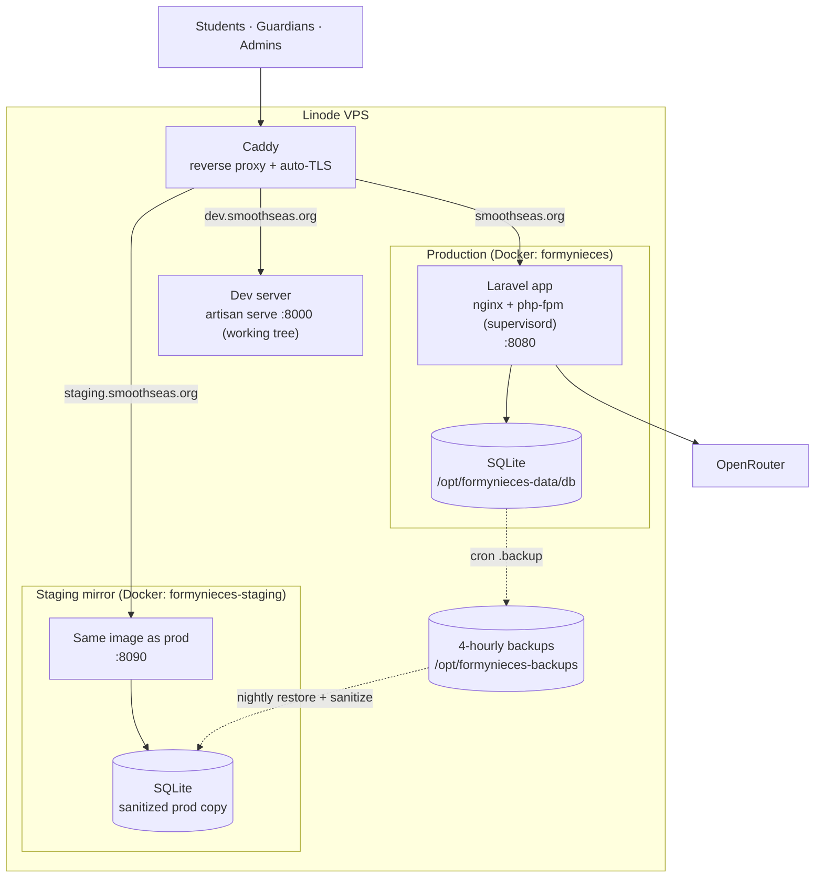

# Architecture Overview

Described with the [C4 model](https://c4model.com/): a **context** view (who uses the system and
what it depends on) and a **container** view (the runnable/ deployable pieces). Diagrams are Mermaid,
so they version with the code.

!!! note "Stack at a glance"
    Laravel 13 (PHP 8.3) · Filament 4 · Livewire 3 · Alpine 3 · Pest 4 · SQLite · Docker on a Linode
    VPS behind Caddy · OpenRouter (Qwen/vision models) for AI features. The teaching/scoring engine is
    **deterministic PHP** — AI is deliberately kept off the mastery path.

## C1 — System context

## C2 — Containers

See [Environments](../operations/environments.md) for the full prod/staging/dev topology and
[Deployment & CI](../operations/deployment.md) for how code reaches these containers.

## C3 — Inside the app (major components)

| Component | Role | Where |
|---|---|---|
| **Learning loop** | Lesson → competency check → practice → mastery, with re-teach | `app/Livewire/{LessonWalk,ModuleEntry,PracticeWalk,ReteachWalk,TutorialWalk}`, `app/Services/Practice/*` |
| **Diagnostic engine** | Adaptive placement; prerequisite inference. **Pure PHP, no AI** | `app/Services/Diagnostic/*` |
| **Voyage** | The gamified map that is the student home | `app/Services/Pacing/AdventureMapBuilder.php`, `app/Support/Voyage*` |
| **Guardian portal** | Honest dashboard, family, billing, school journal | `app/Livewire/Guardian*`, `app/Http/Controllers/Guardian*` |
| **Pacing & motivation** | Weekly targets, streaks, daily plan | `app/Services/Pacing/*`, `app/Services/Motivation/*` |
| **Content** | Lessons, practice bank, reading passages, writing prompts | `database/data/*`, `database/seeders/*` (idempotent) |
| **AI edges** | Essay scoring, re-teach chat, journal OCR — budget-capped | `app/Services/{LlmService,LlmBudget}.php`, `app/Services/Writing/*`, `app/Services/SchoolJournal/OcrService.php` |
| **QA surface** | Manifest + report inbox for the walkthrough agent | `app/Http/Controllers/QaController.php` |

## Key architectural decisions

- **Deterministic teaching path.** Scoring, mastery, and prerequisite inference are plain PHP so they
  are testable and never depend on an LLM. AI is confined to the edges and gated by a per-student
  monthly budget ([`LlmBudget`](../architecture/learning-loop.md#ai-at-the-edges)).
- **Content is data, seeded idempotently.** Modules, lessons, questions, passages live in
  `database/data/` and seed via `updateOrCreate` — **never** `truncate` (a truncating seeder once
  cascade-wiped learner progress; see [Runbooks](../operations/runbooks.md)). Production deploys run
  migrations only; content is seeded manually per-class.
- **SQLite on a host volume.** Simple and fast for this scale; the DB file is mounted into the
  container and never baked into the image, so rebuilds never touch data.
- **One build, promoted to both environments.** CI builds a single SHA-tagged image and runs prod and
  staging from it, asserting parity — see [Deployment & CI](../operations/deployment.md).
