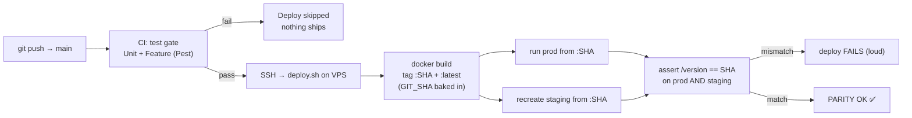

# Deployment & CI

Production deploys on every push to `main`, gated by the test suite, with prod and staging kept on the
**same verified artifact**.

## Pipeline



Defined in `.github/workflows/deploy.yml` (test gate + SSH deploy) and `deploy.sh` (build, run, parity).

## Guarantees

- **Nothing untested ships.** The `deploy` job `needs: test`; a red suite skips deploy entirely.
- **CI mirrors prod's PHP build.** The runner installs the same extensions and **disables GD** (`:gd`)
  because the prod image has no GD — otherwise environment-specific tests diverge.
- **One artifact, both environments.** `deploy.sh` builds a single `formynieces:<sha>` image and runs
  both prod and staging from it. The commit SHA is baked into `version.txt`.
- **Parity is asserted, not assumed.** After deploy, `/version` on prod and staging must both report the
  deployed SHA or the deploy hard-fails. Logged as `PARITY OK` in `/opt/formynieces-backups/deploy.log`.
- **The DB is never touched by a rebuild.** Only `php artisan migrate --force` runs (schema, additive).
  `db:seed` is **never** run on prod — content is seeded manually per idempotent class.
- **Every deploy backs up first.** `deploy.sh` takes a WAL-safe `.backup` before building and aborts if
  the DB volume is missing/empty (never starts fresh).

## Checking what's live

```bash
curl -s https://smoothseas.org/version          # {"commit":"<sha>","env":"production"}
curl -s https://staging.smoothseas.org/version   # same sha, "env":"staging"
grep "PARITY OK" /opt/formynieces-backups/deploy.log | tail -1
```

## Deploying content (manual, deliberate)

Content seeders are idempotent but **not** run automatically. To publish new/updated content:

```bash
docker exec formynieces php artisan db:seed --class=SyllabusModuleSeeder --force
docker exec formynieces php artisan db:seed --class=LessonSeeder --force
docker exec formynieces php artisan db:seed --class=ReadingPassageSeeder --force
# NEVER: php artisan db:seed   (the full seeder is unsafe on prod — see runbooks)
```

## Rolling back

Images are SHA-tagged, so rollback is a re-run of a previous image:

```bash
docker stop formynieces && docker rm formynieces
docker run -d --name formynieces --restart unless-stopped \
  -p 127.0.0.1:8080:8080 \
  -v /opt/formynieces-data/db:/var/www/html/db \
  -v /opt/formynieces-data/storage:/var/www/html/storage \
  formynieces:<previous-sha>
```

For a data rollback, restore from `/opt/formynieces-backups/` (see [Runbooks](runbooks.md)).
