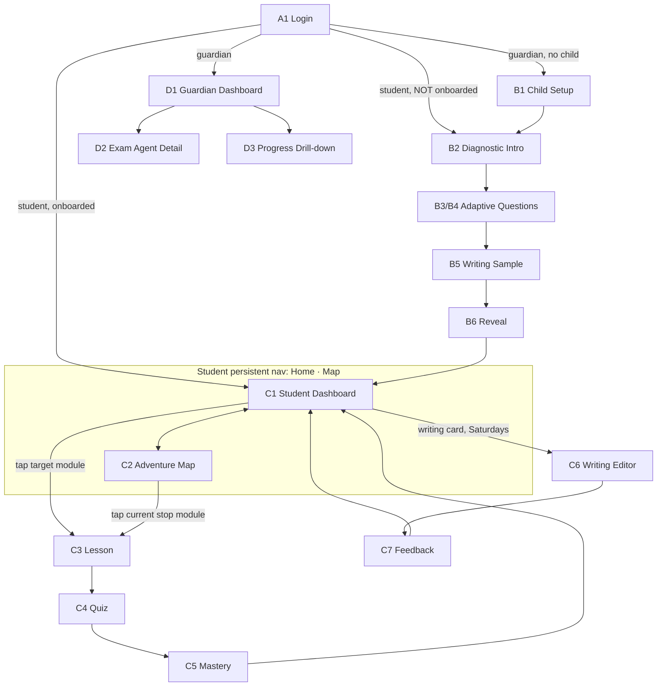

# 03 — Screens & Navigation

Derived from: 02 (objects → list/detail screens; verbs → CTAs or flows) and 01 §2 (interaction **frequency** → navigation depth).
Cross-check: every Gherkin `When/Then` in `features/` must land on a screen here.

**Navigation heuristic (frequency rule):**
- Appears in the **daily** narrative → persistent nav / on the dashboard itself.
- Appears in the **weekly** narrative → one tap from the dashboard.
- Rarer than weekly (onboarding, settings, history) → behind a menu or a one-time flow.

---

## 1. Screen inventory

### A. Shared / auth

| # | Screen | Route (suggested) | Priority | Justifying narrative |
|---|---|---|---|---|
| A1 | Login | `/login` | @mvp | all |
| A2 | Guardian registration (18+ attestation) | `/register` | @mvp | 01 §1.2 |
| A3 | Email verification notice | `/verify-email` | @mvp | 01 §1.2 |
| A4 | Phone verification | `/verify-phone` | @v1.1 | guardian trust |

### B. Onboarding flow (one-time, wizard — not in nav)

| # | Screen | Route | Priority | Notes |
|---|---|---|---|---|
| B1 | Child setup (name, target SEA year, weak areas) | `/onboarding/child` | @mvp | guardian-facing |
| B2 | Diagnostic intro ("a quick adventure…") | `/diagnostic/start` | @mvp | child-facing, warm |
| B3 | Diagnostic question (one MC item, progress dots, no timer) | `/diagnostic/question` | @mvp | adaptive engine drives next item |
| B4 | Encouraging interstitial (every ~8 items) | (inline state of B3) | @mvp | |
| B5 | Writing sample | `/diagnostic/writing` | @mvp | one short prompt |
| B6 | Reveal (animated map population + flag planting) | `/diagnostic/reveal` | @mvp | the emotional payoff |
| B7 | Diagnostic resume ("welcome back, pick up where you left off") | (state of B2) | @mvp | sessions are resumable |

### C. Student (daily loop)

| # | Screen | Route | Priority | Frequency |
|---|---|---|---|---|
| C1 | Student dashboard (greeting, this week's stop, target checklist, streak, writing card) | `/dashboard` | @mvp | daily — home |
| C2 | Adventure map (30 stops, flag, states) | `/map` | @mvp | daily — persistent nav |
| C3 | Module lesson (description + vetted resources) | `/modules/{id}` | @mvp | daily |
| C4 | Module quiz | `/modules/{id}/quiz` | @mvp | daily |
| C5 | Quiz result / mastery celebration | (state of C4) | @mvp | daily |
| C6 | Writing prompt + editor | `/writing` | @mvp | weekly — one tap from dashboard card |
| C7 | Writing feedback view | `/writing/{id}` | @mvp | weekly |
| C8 | Writing history + rubric profile | `/writing/history` | @v1.1 | occasional |
| C9 | Revision-mode dashboard variant (buffer weeks) | (state of C1/C2) | @roadmap | last 6 weeks |
| C10 | Exam-week calm state | (state of C1) | @roadmap | once |

### D. Guardian (weekly loop)

| # | Screen | Route | Priority | Frequency |
|---|---|---|---|---|
| D1 | Guardian dashboard (the four Sunday questions: target done? pace? recommendation? writing?) | `/guardian` | @mvp | weekly — home |
| D2 | Exam agent detail (honest pace chart, 50/30/20 weighted readiness, weak strands) | `/guardian/agent` | @mvp | weekly, one tap |
| D3 | Module-level progress drill-down (mastered / in-review / upcoming buckets) | `/guardian/progress` | @mvp | occasional |
| D4 | Writing feedback (guardian view) | `/guardian/writing` | @v1.1 | weekly |
| D5 | Settings: pause/resume child (S6) | `/guardian/settings` | @v1.1 | rare |
| D6 | Invite second guardian, read-only (S8) | `/guardian/settings` | @roadmap | once |
| D7 | Weekly email digest (S7) | (email, not screen) | @v1.1 | weekly push |

### E. Admin (Filament — already scaffolded)

| # | Screen | Priority | Notes |
|---|---|---|---|
| E1 | SyllabusModuleResource | @mvp ✅ exists | vetted-resources repeater built |
| E2 | AnchorQuestionResource | @v1.1 | MVP seeds via seeder; UI later |
| E3 | Student overview / diagnostics monitor | @v1.1 | |

**Count:** MVP = 18 screens/states (A:3, B:7, C:7 incl. states, D:3 minus states… effectively ~16 distinct routes). Close to the 21-screen sitemap from the 09 June session — the deltas are the additions B7 (resume) and C8 (history, deferred) and the deferral of D4–D7.

---

## 2. Navigation map

**Routing guards:**
- `onboarding_completed_at IS NULL` + role=student → force B2 (or B7 if a session is open).
- Guardian without a linked child → force B1.
- Buffer weeks (week > 24 of 30) → C1/C2 render revision variant (`@roadmap`).

## 3. Navigation principles (from the frequency rule)

1. Student persistent nav has exactly **two** items: Home, Map. Everything else is reached through cards on Home. A 10-year-old never sees a hamburger menu.
2. Guardian home is a **single screen that answers the four Sunday questions**; drill-downs are one tap, never required.
3. Onboarding is a rail (no nav escape mid-diagnostic — only "save and finish later," which closes the session resumably).
4. Honest/agent content never appears in student routes; motivational framing never replaces data in guardian routes. (Two-layer model enforced at the routing level.)
