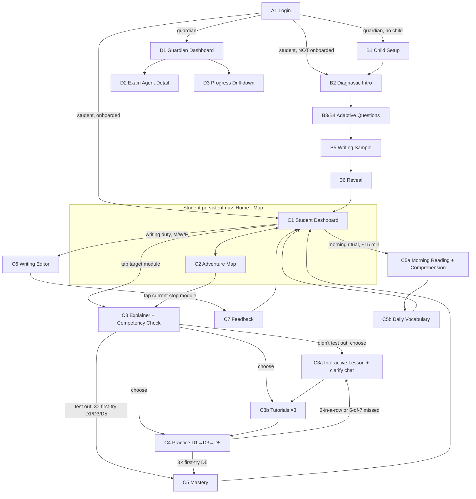

# 03 — Screens & Navigation

Derived from: 02 (objects → list/detail screens; verbs → CTAs or flows) and 01 §2 (interaction **frequency** → navigation depth).
Cross-check: every Gherkin `When/Then` in `features/` must land on a screen here.

**Navigation heuristic (frequency rule):**
- Appears in the **daily** narrative → persistent nav / on the dashboard itself.
- Appears in the **weekly** narrative → one tap from the dashboard.
- Rarer than weekly (onboarding, settings, history) → behind a menu or a one-time flow.

---

## 1. Screen inventory

### A. Shared / auth

| # | Screen | Route (suggested) | Priority | Justifying narrative |
|---|---|---|---|---|
| A1 | Login | `/login` | @mvp | all |
| A2 | Guardian registration (18+ attestation) | `/register` | @mvp | 01 §1.2 |
| A3 | Email verification notice | `/verify-email` | @mvp | 01 §1.2 |
| A4 | Phone verification | `/verify-phone` | @v1.1 | guardian trust |

### B. Onboarding flow (one-time, wizard — not in nav)

| # | Screen | Route | Priority | Notes |
|---|---|---|---|---|
| B1 | Child setup (name, target SEA year, weak areas) | `/onboarding/child` | @mvp | guardian-facing |
| B2 | Diagnostic intro ("a quick adventure…") | `/diagnostic/start` | @mvp | child-facing, warm |
| B3 | Diagnostic question (one MC item, progress dots, no timer) | `/diagnostic/question` | @mvp | adaptive engine drives next item |
| B4 | Encouraging interstitial (every ~8 items) | (inline state of B3) | @mvp | |
| B5 | Writing sample | `/diagnostic/writing` | @mvp | one short prompt |
| B6 | Reveal (animated map population + flag planting) | `/diagnostic/reveal` | @mvp | the emotional payoff |
| B7 | Diagnostic resume ("welcome back, pick up where you left off") | (state of B2) | @mvp | sessions are resumable |

### C. Student (daily loop)

| # | Screen | Route | Priority | Frequency |
|---|---|---|---|---|
| C1 | Student dashboard (greeting, this week's stop, target checklist, streak, writing card) | `/dashboard` | @mvp | daily — home |
| C2 | Adventure map (30 stops, flag, states) | `/map` | @mvp | daily — persistent nav |
| C3 | Level entry: loop explainer + competency check (D1/D3/D5 test-out), then the ways in — lesson/worked-examples/practice, **gated in sequence** when the module has both a lesson and worked examples (later stages greyed with a child-friendly popup; LE-03/LE-06) | `/practice/{module}/enter` | @mvp ✅ | daily |
| C3a | Interactive module lesson (authored page + LLM clarify chat; 4 interaction types LE-07…10) | `/practice/{module}/lesson` | @mvp ✅ | daily — when she doesn't test out |
| C3b | Worked examples / tutorial (guarded behind the lesson when gated) | `/practice/{module}/tutorial` | @mvp ✅ | daily |
| C4 | Practice (D1→D3→D5 climb; AI-assisted re-teach on the miss triggers) | (state of C3) | @mvp | daily |
| C5 | Mastery celebration | (state of C4) | @mvp | daily |
| C5a | Morning reading — passage + comprehension check (resumable, warm feedback, no grade, streak) | `/morning/reading` | @mvp | daily — from Voyage home |
| C5b | Daily vocabulary — words drawn from the passage, use-in-sentence, spaced review | `/morning/vocabulary` | @mvp | daily — follows reading, completes the ~15-min ritual |
| C6 | Writing prompt + editor | `/writing` | @mvp | Mon/Wed/Fri — from the Captain's Brief writing duty (was the dashboard card) |
| C7 | Writing feedback view | `/writing/{id}` | @mvp | weekly |
| C8 | Writing history + rubric profile | `/writing/history` | @v1.1 | occasional |
| C9 | Revision-mode dashboard variant (buffer weeks) | (state of C1/C2) | @roadmap | last 6 weeks |
| C9a | Student school journal — her own score-free filing view (upload + calm list, no marks shown) | `/journal` | @mvp ✅ | SJ-01/SJ-06 — same journal, child-layer clean |
| C10 | Exam-week calm state | (state of C1) | @roadmap | once |
| C11 | Captain's Orders — collapsible Voyage sidebar; **Captain's Brief** tab = today's minimum checklist (morning + evening brief), writing on M/W/F, weekend rest/catch-up | sidebar on the Voyage (`/map`) | @mvp | daily — persistent on the Voyage |
| C12 | Ship's Log — sidebar tab: master + sub streaks, history/milestones, and the **Captain's Locker** reward inventory (spend Shore Leave/Anchor/Tailwind/Lifebuoy) | sidebar on the Voyage (`/map`) | @mvp | daily/occasional |

### D. Guardian (weekly loop)

| # | Screen | Route | Priority | Frequency |
|---|---|---|---|---|
| D1 | Guardian dashboard (the four Sunday questions: target done? pace? recommendation? writing?) | `/guardian` | @mvp | weekly — home |
| D2 | Exam agent detail (honest pace chart, 50/30/20 weighted readiness, weak strands) | `/guardian/agent` | @mvp | weekly, one tap |
| D3 | Module-level progress drill-down (mastered / in-review / upcoming buckets) | `/guardian/progress` | @mvp | occasional |
| D4 | Writing feedback (guardian view) | `/guardian/writing` | @v1.1 | weekly |
| D5 | Settings: pause/resume child (S6) | `/guardian/settings` | @v1.1 | rare |
| D6 | Invite second guardian, read-only (S8) | `/guardian/settings` | @roadmap | once |
| D7 | Weekly email digest (S7) | (email, not screen) | @v1.1 | weekly push |
| D8 | School journal — file a graded paper (upload photo/PDF + structured entry) | `/guardian/students/{id}/journal` | @mvp ✅ | SJ-01..13 — nova-lite OCR chain + confirm/correct + per-question breakdown (syllabus-aligned topics, question clips, reasoning notes) + term timeline + trend; dashboard "From school" section (SJ-04) |
| D9 | School journal — term timeline (entries grouped by term, strand/score/comment at a glance) | same page as D8 | @mvp ✅ | SJ-03/09 — one page serves both |

### E. Admin (Filament — already scaffolded)

| # | Screen | Priority | Notes |
|---|---|---|---|
| E1 | SyllabusModuleResource | @mvp ✅ exists | vetted-resources repeater built |
| E2 | AnchorQuestionResource | @v1.1 | MVP seeds via seeder; UI later |
| E3 | Student overview / diagnostics monitor | @v1.1 | |
| E4 | AI usage panel (per-student month-to-date tokens + spend vs USD 1.00/1.50 caps, guided-time used today, roll-up total) | @mvp ✅ | AG-09/10 — reads `student_llm_usage` + `student_guided_time` |
| E5 | Child-safety flags (concerning AI-tutor messages flagged for follow-up; guardian + admin) | @mvp | AG-15 — reads `safety_flags`; data captured, view not yet built |
| E6 | Reading pool authoring/import (passages + comprehension questions + marked vocabulary, keyed by reading level) | @mvp | DR-06 — stocks `reading_passages` / `vocabulary_words` in advance |
| E7 | LessonResource — author a lesson from typed interaction blocks (Builder), + bulk JSON import (upsert by module code, preview), export (all + per-row), and version-controlled seeding | @mvp ✅ | LE-05 + LB-01/02/03 |
| E8 | Lesson Import Guide — navigable, exhaustive reference (per block type) + downloadable template | @mvp ✅ | LB-04 — generated from `LessonBlockSchema` |
| E9 | Create Lessons with Claude — workflow guide: generate a lesson + question bank with Claude Code from a textbook/past-paper upload; states the re-teach block fields (`rule`/`practiceItems`) and the ≥15-questions-per-level minimum | ✅ | LB-05 — pairs the `lesson-authoring` skill |

**Count:** MVP = 18 screens/states (A:3, B:7, C:7 incl. states, D:3 minus states… effectively ~16 distinct routes), plus the daily morning ritual (C5a reading, C5b vocabulary) and its admin authoring screen (E6), and the lesson authoring + bulk-import screens (E7 LessonResource, E8 Import Guide). Close to the 21-screen sitemap from the 09 June session — the deltas are the additions B7 (resume) and C8 (history, deferred), the daily-reading/vocabulary ritual (C5a/C5b/E6), the lesson authoring/import (E7/E8), the deferral of D4–D7, the school journal (D8/D9), and the public landing page (F1).

### F. Public / marketing (no auth)

| # | Screen | Route | Priority | Notes |
|---|---|---|---|---|
| F1 | Landing page — parent-pain hero with an auto-rotating jumbotron of the core messages + Smooth, the eight pillars (visibility, adaptability, enjoyment, convenience, coverage, effectiveness, reinforcement, consolidation), how-it-works, pricing ($200/month with the 14-day money-back + measurable-improvement guarantees, flexible 20-min–2-hr learning with unlimited practice), CTAs; gender-neutral copy for boys and girls | `/` | @mvp ✅ | LP-01…13 — Smooth poses reused from the student app; school-journal pillar marked "coming in the MVP" until SJ-01…06 are built |
| F2 | About — the origin story (built for family, Caribbean-made), the four beliefs, why a turtle; funnels to the call | `/about` | @mvp ✅ | AB-01…04 |
| F3 | FAQ — the questions parents actually ask (programme, child experience, parent experience, money/tech/safety) as accordions; funnels to the call | `/faq` | @mvp ✅ | FQ-01…05 |
| F4 | Contact — message form (name, email, topic, message) → `contact_messages`, confirmation banner; admin inbox in the panel | `/contact` | @mvp ✅ | CU-01…03 — "Contact Messages" resource (Website group) |
| F5 | Book a call — the 15-minute onboarding-call booking: two weeks of days, weekday 5:00–7:45pm + Saturday 8:00am–4:45pm slot starts (TT time), Sundays closed; parent details form; confirmation screen; admin calendar in the panel | `/book-a-call` | @mvp ✅ | OC-01…05 — "Onboarding Calls" resource (Website group); no double-booking (unique slot) |
| F6 | Smooth chat widget — proactive popup (guests only, once per 30 days, after ~35s or half-scroll), scripted bot qualification (name, standard, worry, contact) → `chat_conversations`/`chat_messages`, Slack webhook + email notify, WhatsApp (`wa.me` click-to-chat) + book-a-call handoffs, honest "within a few hours" reply promise; admin "Chats" inbox with transcript + close | (widget on all public pages) | @mvp ✅ | LC-01…06 — set `SLACK_CHAT_WEBHOOK_URL` to light up Slack; email fallback always on |

---

## 2. Navigation map

```mermaid
flowchart TD
    L[A1 Login] -->|student, onboarded| C1[C1 Student Dashboard]
    L -->|student, NOT onboarded| B2[B2 Diagnostic Intro]
    L -->|guardian, no child| B1[B1 Child Setup]
    L -->|guardian| D1[D1 Guardian Dashboard]

    B1 --> B2 --> B3[B3/B4 Adaptive Questions] --> B5[B5 Writing Sample] --> B6[B6 Reveal] --> C1

    subgraph StudentNav [Student persistent nav: Home · Map]
      C1 <--> C2[C2 Adventure Map]
    end
    C1 -->|tap target module| C3[C3 Explainer + Competency Check]
    C3 -->|test out: 3× first-try D1/D3/D5| C5[C5 Mastery]
    C3 -->|didn't test out: choose| C3a[C3a Interactive Lesson + clarify chat]
    C3 -->|choose| C3b[C3b Tutorials ×3]
    C3 -->|choose| C4[C4 Practice D1→D3→D5]
    C3a --> C3b --> C4
    C4 -->|2-in-a-row or 5-of-7 missed| C3a
    C4 -->|3× first-try D5| C5
    C5 --> C1
    C2 -->|tap current stop module| C3
    C1 -->|writing duty, M/W/F| C6[C6 Writing Editor] --> C7[C7 Feedback] --> C1
    C1 -->|morning ritual, ~15 min| C5a[C5a Morning Reading + Comprehension] --> C5b[C5b Daily Vocabulary] --> C1

    D1 --> D2[D2 Exam Agent Detail]
    D1 --> D3[D3 Progress Drill-down]
```

**Routing guards:**
- `onboarding_completed_at IS NULL` + role=student → force B2 (or B7 if a session is open).
- Guardian without a linked child → force B1.
- Buffer weeks (week > 24 of 30) → C1/C2 render revision variant (`@roadmap`).

## 3. Navigation principles (from the frequency rule)

1. Student persistent nav has exactly **two** items: Home, Map. On the Voyage a collapsible **Captain's Orders** sidebar carries the day's Brief and the Ship's Log (CO/SL); everything else is reached through cards on Home. A 10-year-old never sees a hamburger menu.
2. Guardian home is a **single screen that answers the four Sunday questions**; drill-downs are one tap, never required.
3. Onboarding is a rail (no nav escape mid-diagnostic — only "save and finish later," which closes the session resumably).
4. Honest/agent content never appears in student routes; motivational framing never replaces data in guardian routes. (Two-layer model enforced at the routing level.)
